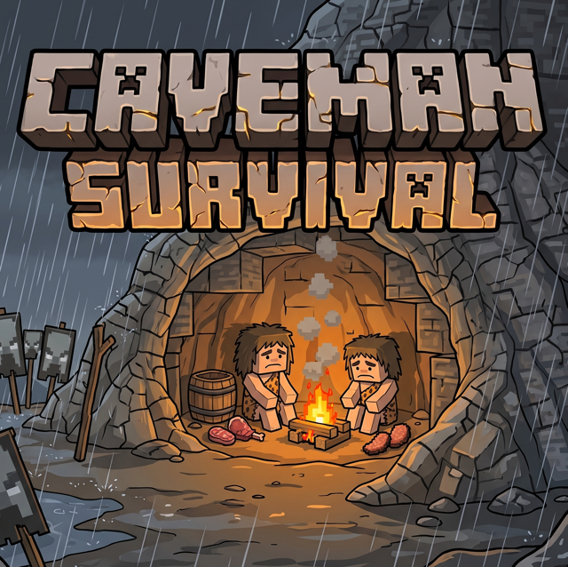

  

# Caveman Survival Modpack

  

Welcome to the **Caveman Survival Modpack**! This modpack is designed to strip Minecraft down to its primal roots. Forget iron and diamond tools, forget easy infinite water, and forget surviving a night out in the open without consequences. This is a grueling, realistic survival experience for NeoForge 1.20.1.

  

## Features in Detail

### 🩸 Real Human Needs & Injuries
- **Thirst & Temperature**: You must manage your hydration and body temperature. Rain will freeze you; being near lava without protection will overheat you.
- **Locational Damage**: Vanilla health is replaced with specific body part health (head, torso, arms, legs). A broken leg will slow you down, and a head injury will blur your vision.
- **Sleep & Exhaustion**: If you skip sleeping, you will develop insomnia, become exhausted, and eventually pass out where you stand. You can sleep on the ground using bedrolls, but you better hide—sleeping in the open makes you vulnerable.

### 🌋 Severe Environmental Hazards
- **Realistic Smoke**: Campfires and furnaces produce physical smoke that rises and spreads. If you build a campfire in an enclosed cave without a chimney, the smoke will suffocate you.
- **Rip Currents**: Rivers are no longer static water blocks. They have aggressive flowing currents that will push you and animals downstream. Crossing a river without a boat is extremely dangerous.
- **Large Biomes & Seasons**: Biomes are massive, making travel and escaping bad biomes difficult. The world undergoes full seasonal cycles (Summer, Autumn, Winter, Spring).

### 🪨 Restricted Primal Technology
- **No Advanced Ores**: The crafting recipes for all Wooden, Iron, Golden, Diamond, and Netherite tools and armor have been completely removed via custom KubeJS scripts. 
- **Stone Age**: You are restricted to using Stone and Flint. If you manage to find lava on the surface or near volcanoes (underground lava generation has been disabled), you can cool it to obtain Obsidian for top-tier primal equipment.
- **Grueling Mining**: Mining blocks takes significantly longer. Building a simple base requires real time and effort.

## Installation (Overrides Pack Format)

### To play immediately in Prism Launcher / MultiMC:
1. Create a new instance for **Minecraft 1.20.1** and install **NeoForge**.
2. Open the instance's `.minecraft` folder.
3. Copy the `mods` and `kubejs` folders from this repository directly into the `.minecraft` folder.
4. Launch the game and survive!

### Exporting to Modrinth / CurseForge
If you want to upload this pack to CurseForge or Modrinth to share with others, you can simply zip this entire directory (the `mods` and `kubejs` folders) and upload it as a "Server Pack" or "Custom Profile" zip. 

Enjoy the grueling survival experience!
